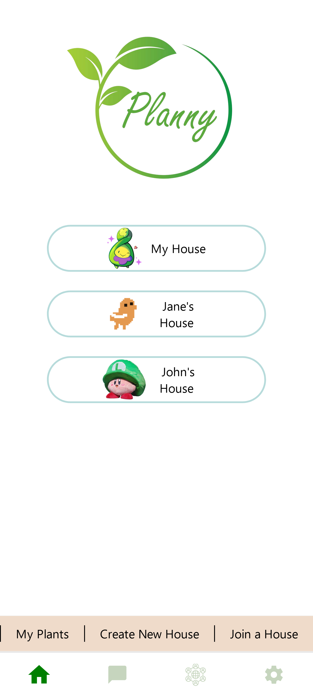
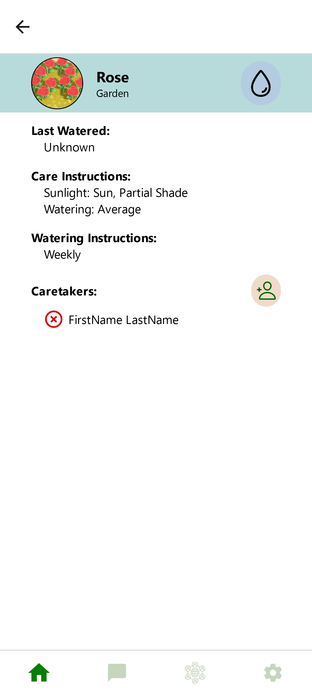
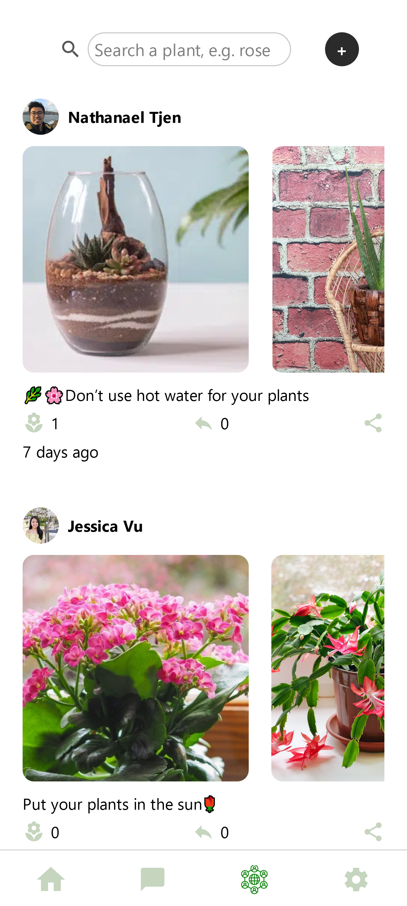
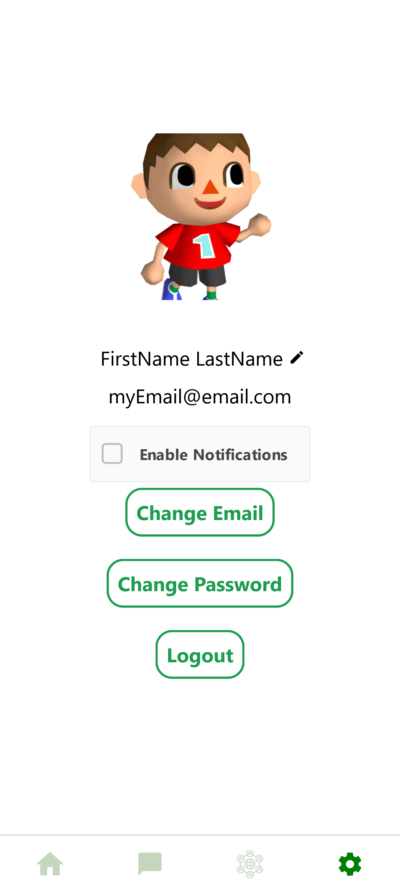
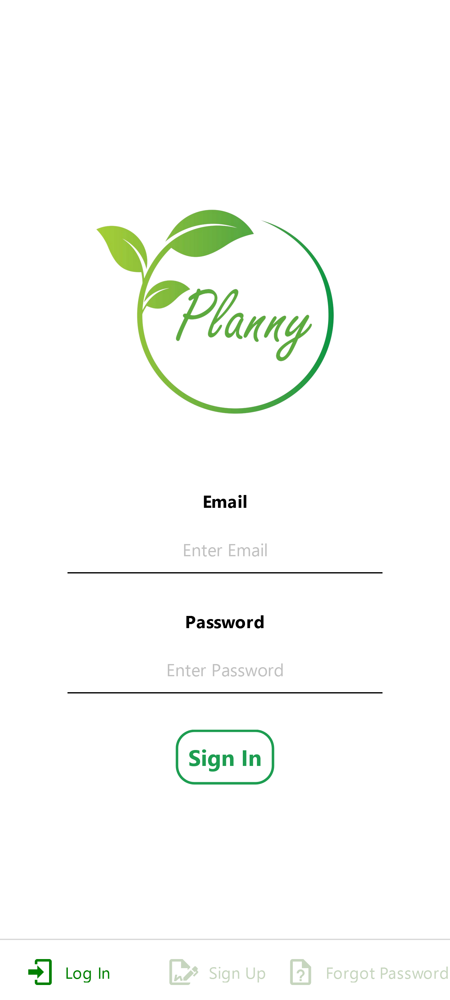

<!-- Improved compatibility of back to top link: See: https://github.com/othneildrew/Best-README-Template/pull/73 -->

<!--
*** Thanks for checking out the Best-README-Template. If you have a suggestion
*** that would make this better, please fork the repo and create a pull request
*** or simply open an issue with the tag "enhancement".
*** Don't forget to give the project a star!
*** Thanks again! Now go create something AMAZING! :D
-->

<!-- PROJECT SHIELDS -->
<!--
*** I'm using markdown "reference style" links for readability.
*** Reference links are enclosed in brackets [ ] instead of parentheses ( ).
*** See the bottom of this document for the declaration of the reference variables
*** for contributors-url, forks-url, etc. This is an optional, concise syntax you may use.
*** https://www.markdownguide.org/basic-syntax/#reference-style-links
-->

<!-- PROJECT LOGO -->
 

  

<h3 align="center">Planny</h3>

  

    Organize nannies for your plants
     
  

<!-- ABOUT THE PROJECT -->
## About The Project

A weeklong personal project with a team of 6 to develop a mobile application for plant enthusiasts and households to simplify and streamline plant care.

With Planny, users can add plants to their profile, join different households, assign household members to each plant, message amongst households, and track plant care activities such as watering.

Planny is perfect for those who want to track their plant care while away from their plant babies.

Planny's aim is to foster collaboration and accountability by bringing households together in a fun and engaging way, one plant at a time.

## Built With

<!-- * [![Next][Next.js]][Next-url] -->

## Mobile Application
<!-- [![Product Name Screen Shot][product-screenshot]](https://example.com) -->
<!-- Insert plant screenshots here -->

   
   
   
   
  

(<a href="#readme-top">back to top</a>)

<!-- MARKDOWN LINKS & IMAGES -->
<!-- https://www.markdownguide.org/basic-syntax/#reference-style-links -->